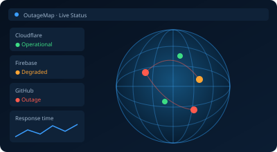
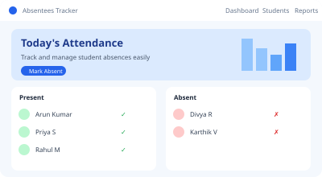
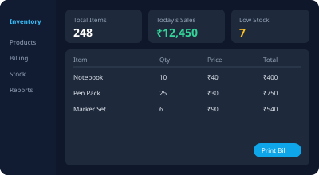

<!-- Save as README.md in the repo named exactly: Fahim007-cloud -->
<!-- Needs in /assets: header, footer, divider, skills, outagemap, absentees-tracker, inventory-billing (.svg) -->

<table>
<tr>
<td align="center" width="170">

</td>
<td>

</td>
</tr>
</table>

 

<!-- ================= ABOUT + TECH STACK ================= -->
<table>
<tr>
<td width="50%" valign="top">

## 👤 About Me

🎓 I'm a student developer passionate about software development.

🌱 Currently learning **React, Java** and modern web technologies.

💡 Interested in building practical applications that solve real-world problems.

☁️ Exploring frontend development, databases and cloud platforms.

🎯 My goal is to become a skilled software engineer.

👥 Open to collaborating on interesting projects and learning from other developers.

</td>
<td width="50%" valign="top">

## `</>` Tech Stack

**Frontend Development** 

**Programming Language** 

**Database & Backend Services** 

**Tools & Platforms** 

</td>
</tr>
</table>

<!-- ================= CURRENTLY ================= -->
<table>
<tr>
<td width="50%" valign="top">

## ⚡ Currently

- 🔭 Working on: **OutageMap** & **Inventory and Billing**
- 📚 Learning: **React, Java, OOP**
- 🤝 Looking to: **collaborate on open-source projects**
- 💬 Ask me about: **HTML, CSS, JavaScript, Python**
- 🌱 Next up: **deploying full-stack apps**

</td>
<td width="50%" valign="top" align="center">

</td>
</tr>
</table>

<!-- ================= FEATURED PROJECTS ================= -->
## 🚀 Featured Projects

<table>
<tr>

<td width="25%" valign="top">

### [OutageMap ↗](https://github.com/Fahim007-cloud/outagemap)
A modern web app that checks website availability and response time in real time.

</td>

<td width="25%" valign="top">

### [Student Absentees Tracker ↗](https://github.com/Fahim007-cloud/absentees-tracker)
A student attendance tracking application designed to simplify absence management.

</td>

<td width="25%" valign="top">

### [Inventory & Billing ↗](https://github.com/Fahim007-cloud/inventory-and-billing)
An inventory management and billing application for tracking stock and generating bills.

</td>

<td width="25%" valign="top" align="center">

### ➕
**More Projects Coming Soon**

Continuously learning, experimenting with new technologies, and building useful applications.

</td>

</tr>
</table>

[**View all projects →**](https://github.com/Fahim007-cloud?tab=repositories)

 

<!-- ================= GITHUB STATS ================= -->
## 📊 GitHub Statistics

 <b>Fahim007-cloud</b>
  

<table>
<tr>
<td width="50%" valign="top">

</td>
<td width="50%" valign="top">

</td>
</tr>
</table>

### 🐍 Contribution Snake

### 🏆 Achievements

<!-- ================= GOALS + CONNECT ================= -->
<table>
<tr>
<td width="50%" valign="top">

## 🎯 My Current Goals

- ✅ Strengthen my programming fundamentals.
- ✅ Improve my React development skills.
- ✅ Practise Java and object-oriented programming.
- ✅ Build and deploy practical software projects.
- ✅ Collaborate with other developers.
- ✅ Grow as a software engineer.

</td>
<td width="50%" valign="top">

## 🔗 Connect With Me

 

**`</>` Code. Learn. Build. Repeat. 🚀**

</td>
</tr>
</table>

